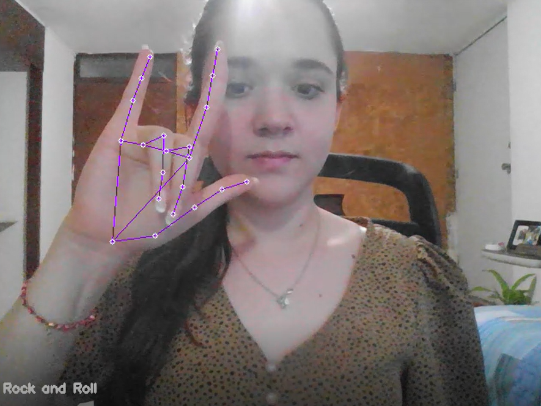

## Reto-3-CV-Challenges

# Hand Tracking and gesture detection.
The objective of this project is track your hands by using MediaPipe Hands which is a Google solution.

The steps of the project are the following:
  - Hand detection by using the MediaPipe Hands Solution.
  - Get every finger position to recognize if they're up or down.
  - Personalize the gestures you'd like to detect and identify them.
  - Display the final result.
  
## Hand detection by using the MediaPipe Hands Solution.
MediaPipe is a Framework for building machine learning pipelines for processing time-series data. In this case we will be using MediaPipe Hands which allows us to track hands and fingers by employing ML to interfet 21 3D landmarks of a hand.

## Get every finger position to recognize if they're up or down.
I used the hand landmark model which provides a collection of detected/tracked hands, where each hand is represented as a list of 21 hand landmarks and each landmark is composed of x, y and z. 
I compared the tip and middle points of every finger to identify if it's up or down.

## Identify gestures.
After knowing how to identify if a finger is up or down, i chose some hand gestures and set them to identify.
## Final result.
Enjoy!

## References.
  - https://google.github.io/mediapipe/solutions/hands.html
  - https://www.youtube.com/watch?v=ipHKQVtwRas&t=1108s
  - https://www.youtube.com/watch?v=_zjKszdAVG8&t=652s

Thanks for reading!

_Patty Canales_
